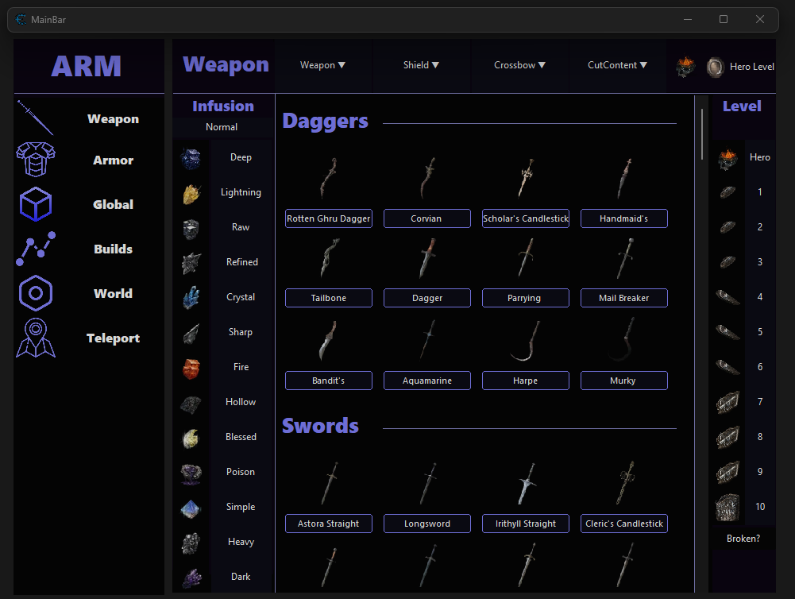

# Dark Souls III ARM GUI Cheat Table

Dark Souls 3 Cheat Engine table providing a GUI tool for creating builds.

---

##  Dependencies

- **Game Version:** 1.15.2
- **Cheat Engine:** 7.5 or higher

---

## How to Use (Cheat Engine)

1. **Download Cheat Engine 7.5 or higher:**
   - [GitHub](https://github.com/cheat-engine/cheat-engine)
   - [Official Website](https://www.cheatengine.org/)

2. **Launch Dark Souls III.**

3. **Load the Cheat Table File:**
   - Open `GUI ITEM GIB.CT` in Cheat Engine.

4. **Activate Scripts:**
   - Enable the `ItemGib` script.
   - Enable the `</>` script.

5. **Enjoy!**
   - The table is now ready for use.

---

##  FAQ

### Q: The table doesn't work. What should I do?
A: Ensure that:
   - You are using the correct version of Dark Souls III (1.15.2).
   - You have Cheat Engine 7.5 or higher installed.
### Q: The GUI does not open ?
A: Ensure that:
   - Go to tab `▼ GUI`, and switch on `Show GUI`.
   - You have Cheat Engine 7.5 or higher installed.
### Q: Can I use this table for online play?
A: All functions for which you can be banned are marked in red. All other functions are legal

---

## 🔗 Links
- [Official Cheat Engine](https://www.cheatengine.org/)
- [Cheat Engine Official Website](https://www.cheatengine.org/)
